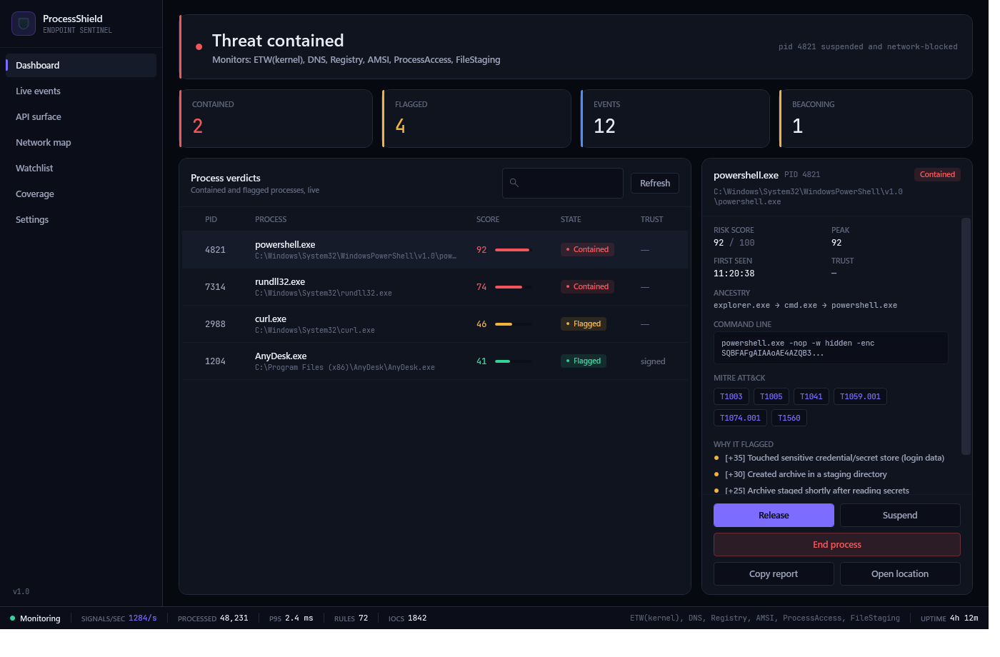
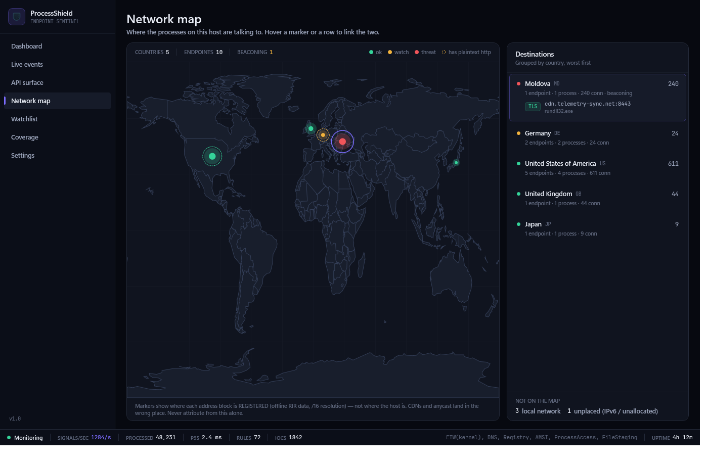
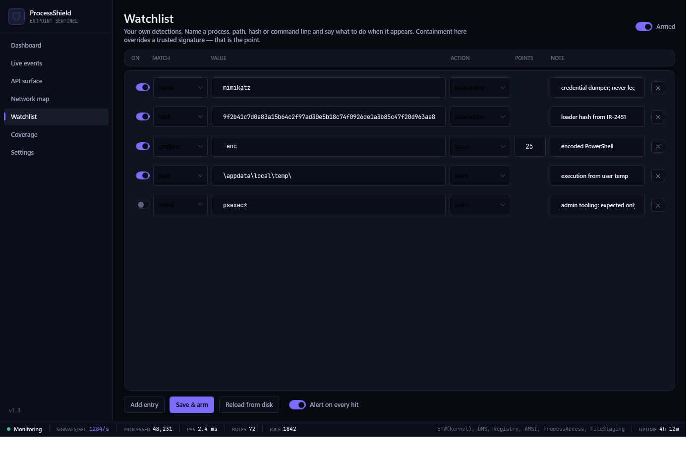

<div align="center">


# ProcessShield

**An open, hackable Windows EDR framework — behavioural detection, ATT&CK-mapped JSON rules,
encrypted containment, SIEM-native telemetry, and a built-in API inspector for the endpoints
your machine actually talks to.**

[](LICENSE)
[](https://dotnet.microsoft.com/)
[](#)
[](#verifying-a-build)

</div>

<div align="center">

</div>

<div align="center">

<table>
<tr>
<td width="50%"></td>
<td width="50%"></td>
</tr>
<tr>
<td align="center"><b>Network map</b> — where this host is talking, resolved entirely offline</td>
<td align="center"><b>Watchlist</b> — your own detections, armed without a restart</td>
</tr>
</table>

</div>

---

ProcessShield watches processes through ETW kernel and user-mode sessions, scores the classic
**collect → archive → exfil** chain alongside persistence, credential access, C2 beaconing and
DNS abuse, and contains what crosses the line — **suspend-first**, then an injection-safe
firewall block and an **encrypted quarantine vault**, with optional host isolation and forensic
triage collection.

It ships a **console**, a **WPF desktop app**, a **Windows Service** with a mutual watchdog, a
real **kernel minifilter**, a **localhost REST control plane**, and **API Studio** — a
Postman-style request workbench wired directly to the endpoint inventory the agent builds from
observed traffic.

## ⚠️ Honest scope

This is a **hardened prototype plus real integration layers** — not a shippable commercial EDR.
It runs, detects, and contains on a real machine, and its detection logic is regression-tested
offline on every build. But two capabilities are gated behind Microsoft programs and cannot be
delivered as loadable artifacts here (see [External gates](#external-gates)), the new ETW
monitors have not been soak-tested against a live fleet, and no third party has audited any of
it. Use it for labs, research, detection engineering, and learning.

Where a technique is evadable, the code says so in a comment. That is deliberate — a security
tool that overstates itself is worse than one that admits its edges.

## What's here

| Area | What it does |
| --- | --- |
| **Monitoring** | ETW kernel session (process / image / file / TCP, IPv4 **and IPv6**) plus separate user-mode sessions for **DNS**, **AMSI script content**, **registry**, and **cross-process handle access**. WMI fallback and a `FileSystemWatcher` for archive staging. |
| **Detection** | Single-owner (actor) state machine — one thread mutates all profile state, so there are no data races. Correlates exfil chains, LOLBin parent/child, command-line IOCs, and in-memory strings, with **score decay** so a long-lived process cannot trip on accumulated noise. |
| **Rules** | **72 shipped JSON rules** across 5 packs, each carrying MITRE ATT&CK technique ids. Hot-reloadable, community-authorable, no C# required. See [`rules/detection/README.md`](rules/detection/README.md). |
| **ATT&CK** | Every alert carries technique ids; `attack` in the console and the **Coverage** tab render rule coverage against what the host has actually exhibited. **71 techniques across 8 tactics** covered by the default packs. |
| **Analytics** | C2 **beacon detection** (median interval + MAD jitter, not naive equality), **DGA and DNS-tunnel scoring**, and full **process lineage** with PID-reuse and cycle safety. |
| **Watchlist** | Your own detections without writing a rule: name a **process, path, SHA-256 or command line** and *contain on sight*, warn, or score. A contain entry deliberately **overrides a trusted signature**, and is refused against protected Windows processes so a typo cannot bugcheck the host. Hot-reloaded. |
| **Intel** | Drop hash / domain / IP / CIDR / URL indicator feeds into `intel/feeds/`; matching is hash-set based, so a million-entry feed costs the same per event as ten. |
| **File analysis** | Dependency-free PE reader: sections, entropy, imphash, packer indicators, suspicious imports, SHA-256 — bounds-checked at every offset, because it gets pointed at hostile files. |
| **Trust** | Full **Authenticode** verification (`WinVerifyTrust` chain validation + thumbprint pinning); allowlisted publishers get a scoring discount. Trust is only granted on a cryptographically valid chain. |
| **Response** | Suspend-first containment, injection-safe outbound firewall block, **AES-256-GCM encrypted quarantine vault** with restore and integrity verification, **config-driven playbooks**, **host isolation** with an allowlist, and **forensic triage packages**. |
| **Telemetry** | JSONL, syslog (RFC 5424) and HTTP webhook sinks in **native, Elastic Common Schema, OCSF 1.1 or CEF** — so an existing SIEM ingests it without a custom parser. Plus a **keyed (HMAC-SHA256) hash-chained audit log** with a head-anchor and verifier, and **Prometheus metrics**. |
| **API Studio** | Import Postman v2.1 / OpenAPI 3 / Swagger 2 / HAR / curl, or generate a collection from the endpoints this host was **observed** using. Send, assert, chain captures, and grade responses for TLS, security headers, CORS, cookie flags, leaked secrets and PII. Export to Postman / OpenAPI / `.http` / curl / Markdown; report to JSON / JUnit / HTML. |
| **Control plane** | Localhost-only REST API (`/status`, `/profiles`, `/surface`, `/metrics`, `/rules`, `/attack`, `/events`) with bearer auth, off by default, read-only by default. |
| **Replay** | Record or hand-write a JSON-Lines signal trace and replay it through a real engine on a simulated clock — deterministic detection tests in milliseconds, no malware required. |
| **Network map** | Plots every observed destination on a world map, grouped by country, hover-linked to the endpoint list, with **plaintext HTTP called out**. Geolocation is **fully offline** — an EDR that asked a third party where an address is would tell them what you are investigating. |
| **Front-ends** | Console analyst REPL, and a WPF GUI with dashboard, live event feed, **API surface**, **network map**, **watchlist**, **ATT&CK coverage** and settings — plus tray monitoring, CSV/JSON export and one-click incident reports. |

## Quick start

**Requirements:** Windows 10/11 x64, [.NET 8 SDK](https://dotnet.microsoft.com/download), and
**Administrator** rights at run time (ETW, process access, quarantine).

```bash
# Build everything
dotnet build ProcessShield.sln -c Release

# Validate rules + replay every detection scenario -- no admin needed
dotnet run --project ProcessShield.csproj -c Release -- --selftest

# Console agent (from an elevated terminal)
dotnet run --project ProcessShield.csproj -c Release

# WPF desktop GUI
dotnet run --project gui/ProcessShield.Gui -c Release
```

New here? [`GETTING_STARTED.md`](GETTING_STARTED.md) has step-by-step Visual Studio instructions
plus a safe detection-simulation script.

Optional YARA engine (adds the dnYara dependency; the default build uses the builtin scanner):

```bash
dotnet build ProcessShield.csproj -c Release -p:EnableYara=true
```

### Run as a Windows Service

Publish a self-contained exe so the service `binPath` is the app itself, not `dotnet.exe`:

```bash
dotnet publish ProcessShield.csproj -c Release -r win-x64 --self-contained true
# then, from the publish folder, as Administrator:
ProcessShield.exe --install      # install + start the service (+ watchdog task)
ProcessShield.exe --uninstall    # stop + remove
```

## Analyst console

```
list [all]     show contained (or all flagged) processes
info N         full reason breakdown for entry N
tree N         process ancestry for entry N
resume N       un-suspend entry N (release a false positive)
suspend N      re-suspend entry N
kill N         terminate entry N (asks for confirmation)
stats          engine / queue counters
metrics        Prometheus exposition of the same counters
reload         re-read shield.config.json (including rules and intel feeds)
audit          verify the tamper-evident audit log

attack         MITRE ATT&CK coverage vs. what has been observed
rules [id]     list loaded detection rules, or show one in detail
intel          indicator-feed status
surface [pid]  endpoints this host has been seen talking to
api ...        API Studio (see below)

vault ...      list | restore <id> <path> | verify <id> | purge <id>
isolate on|off cut this host off the network except the config allowlist
triage N       collect a forensic package for entry N
replay <file>  replay a detection scenario against a throwaway engine
```

## API Studio

Most API clients start from a spec you already have. ProcessShield can start from **what the
machine is actually doing**:

```
shield> surface                       # every endpoint observed, with beacon scoring
shield> api surface                   # turn those endpoints into a collection
shield> api send 3                    # send it, then grade the response
shield> api run                       # run the whole collection with assertions
shield> api report html out/api.html
```

Or bring your own:

```
shield> api import ./openapi.json     # Postman v2.1 / OpenAPI 3 / Swagger 2 / HAR all auto-detected
shield> api env set token abc123
shield> api export curl 2
```

Grading is **passive**. It draws conclusions only from a response you already requested against
your own endpoint — it never crafts attack payloads, brute-forces, enumerates objects, or tries
to bypass anything. Findings map to the OWASP API Security Top 10 where one genuinely applies.

**API Studio is locked down by default.** Nothing can be sent until you allowlist a host in
`shield.config.json`; POST/PUT/PATCH/DELETE and plain `http://` are refused unless you turn them
on, requests are rate-limited, and responses are size-capped. An EDR that shipped an
unrestricted HTTP client reachable from its console would be a liability, not a feature.

```jsonc
"api": {
  "studio": {
    "allowedHosts": [ "localhost", "127.0.0.1" ],
    "allowMutatingMethods": false,
    "allowInsecureHttp": false,
    "maxRequestsPerSecond": 5.0
  }
}
```

## Writing detections

Detection rules are JSON. No C#, no rebuild:

```json
{
  "id": "curl-to-paste-site",
  "title": "curl.exe uploading to a paste service",
  "severity": "high",
  "score": 40,
  "techniques": ["T1567", "T1105"],
  "kinds": ["ProcessStart"],
  "detection": [{
    "all": [
      { "field": "processName", "op": "equals", "value": "curl.exe" },
      { "field": "commandLine", "op": "regex", "value": "(pastebin|transfer\\.sh)" }
    ]
  }],
  "falsePositives": ["Developers pasting build logs by hand."]
}
```

Drop it in `rules/detection/`, type `reload`, done. A negative `score` writes an allowlist rule
instead. The full schema, every operator and field, and the contribution guide are in
[`rules/detection/README.md`](rules/detection/README.md).

### Or just name the thing

Rules describe *behaviour*. When you already know the *identity* of what you are hunting, the
**Watchlist** tab (or `watchlist` in `shield.config.json`) is faster:

```jsonc
"watchlist": {
  "enabled": true,
  "entries": [
    { "match": "name",    "value": "mimikatz", "action": "quarantine", "note": "red-team tooling" },
    { "match": "hash",    "value": "<sha256>", "action": "quarantine", "note": "IOC from IR-2451" },
    { "match": "cmdline", "value": "-enc",     "action": "score", "score": 25 },
    { "match": "path",    "value": "\appdata\local\temp\\", "action": "warn" }
  ]
}
```

Match on **name**, **path**, **hash** or **cmdline** (names and paths take `*`/`?` globs); act
with **quarantine**, **warn** or **score**. Two properties make it more than a blocklist:

- **A `quarantine` entry outranks a valid Authenticode signature.** If you named the binary by
  hand, "but it's signed" is not a defence — that is the entire point of naming it.
- **It cannot be aimed at Windows itself.** An entry resolving to `lsass.exe`, `csrss.exe`,
  `services.exe`, `svchost.exe` and friends is still *reported*, but containment is refused, so
  a mistyped rule cannot take down the host it is defending.

Entries are validated individually (a pattern matching everything is rejected outright) and
**hot-reloaded** — saving arms them in about a second, no restart.

**Test detections without malware.** `Replay/scenarios/*.jsonl` are signal traces replayed
through a real engine on a simulated clock. Three ship by default, and one of them —
`benign-developer-day.jsonl` — exists purely to prove the rules *don't* fire on ordinary work.
That false-positive guard matters as much as the malicious ones.

## Verifying a build

```powershell
./tools/verify.ps1
```

Builds the solution, runs the full xUnit suite, validates every rule pack, and replays every
detection scenario. As of this commit:

- **2,096 tests passing**, 0 skipped
- **0 build warnings**
- 72 rules loading with 0 validation errors
- 3/3 replay scenarios meeting their expectations

The suite is hermetic: no network, no admin, no real malware. API Studio's HTTP path is proven
end-to-end against a loopback socket server (query encoding, auth, redirect chains, body
truncation, chained token captures, secret redaction) rather than only against mocks.

## Configuration — `shield.config.json`

Thresholds, allowlist (publishers + pinned thumbprints), detection rules path, score decay,
beaconing, intel feeds, response playbook and vault, telemetry format and sinks, the control
API, API Studio safety policy, and service/heartbeat settings. Editing the file **hot-reloads**
posture, allowlist, detection rules and indicator feeds live; a malformed edit keeps the
last-good config. Scan-engine, telemetry-format and control-API changes take effect on restart.

## Security model & honest limitations

- **Audit log integrity.** Records form a keyed HMAC-SHA256 hash chain with a head-anchor, so
  edits, reordering, interior deletion, and **tail truncation/emptying** are all detectable. The
  key lives on disk next to the log — this defeats an attacker who only has a copy of the log or
  can't read the key, so **protect the audit directory with an admin-only ACL**. It does *not*
  defeat a same-privilege attacker who can read the key. For proof against an equal-privilege
  adversary, forward every event off-box to an append-only SIEM (the `syslog`/`webhook` sinks)
  and reconcile against that remote head.
- **The quarantine vault has the same shape of caveat.** AES-256-GCM at rest stops a quarantined
  payload from being re-executed or re-detected as live, and the key sits beside the data — so it
  defeats accident and opportunism, not an attacker who already owns the host at your privilege.
- **`kernelBlocking: true` is aggressive.** The skeleton driver denies *any* open of a sensitive
  path while blocking is on, including legitimate apps. Leave it off until the trusted-PID
  allowlist extension (see the driver README) is added.
- **Host isolation can lock you out.** `isolate` blocks all traffic except
  `response.isolationAllowlist`. If that list is empty you will lose any remote session to the
  machine. The console makes you confirm; a playbook does not.
- **Beacon detection is evadable.** An attacker who randomises the sleep interval widely defeats
  the jitter test, and a beacon slower than the observation window is invisible. It is one signal
  among many, not a verdict.
- **DGA scoring has real false positives** on CDN and cloud hostnames. It scores; it does not
  convict.
- **The network map shows allocation geography, not packet geography.** It resolves the country
  an address block is *registered* to, from offline RIR data at `/16` resolution — so CDNs,
  anycast and hosting resellers land in the wrong place, and IPv6 is not mapped at all. Never
  attribute from a marker. See [`intel/geo/README.md`](intel/geo/README.md).
- **A watchlist `quarantine` entry is a loaded gun by design.** It contains on sight and ignores
  a valid signature, so a careless entry will suspend software you rely on. Protected Windows
  processes are refused outright, but nothing protects you from watchlisting your own EDR agent,
  your backup client, or your VPN.
- **Archive quarantine for ETW-detected files.** ETW reports `\Device\HarddiskVolumeN\...` paths
  that `System.IO` can't open directly, so the move-to-vault step no-ops for those (it fails
  safe; suspend + firewall containment still apply). Archives caught by the `FileSystemWatcher`
  use drive-letter paths and quarantine correctly.
- **The extended ETW monitors are best-effort.** Registry names from the kernel provider can be
  partial, and the Kernel-Audit-API-Calls schema is undocumented and version-dependent — so each
  monitor degrades to a no-op rather than throwing, and the rules match substrings accordingly.

### External gates

- **Tamper protection via PPL/ELAM** requires being an approved anti-malware vendor with an ELAM
  driver attestation-signed by Microsoft. The watchdog + service recovery raise the bar, but an
  admin attacker can still kill both.
- **Production driver signing** needs attestation/WHQL or EV signing via the Partner Center plus
  a Microsoft-assigned altitude. The driver builds and runs in a test-signed lab as-is.

## Kernel minifilter

See [`kernel/ShieldFilter/README.md`](kernel/ShieldFilter/README.md) for building with the WDK,
lab test-signing, and loading. The agent connects via `MinifilterClient` and pushes policy; if
the driver isn't installed, kernel enforcement is simply unavailable and user-mode detection
continues.

## Repository layout

```
ProcessShield.sln              Console + GUI + Tests (VS2022, x64)
├─ Program.cs, ProcessShield.csproj    console front-end + core library
├─ Monitoring/                         ETW kernel, DNS, AMSI, registry, process-access, WMI
├─ Detection/                          scoring actor, JSON rule engine, ATT&CK, beacons, DGA
├─ Response/                           containment, encrypted vault, playbooks, isolation, triage
├─ Analysis/ Intel/                    PE + entropy analysis, indicator feeds, secret scanning
├─ Api/                                API Studio + observed surface + control plane
├─ Memory/ Security/ Telemetry/        scanners, Authenticode, ECS/OCSF/CEF sinks + audit
├─ Hosting/ Configuration/ Native/     composition, service/watchdog, config, P/Invoke
├─ Replay/                             offline trace format, harness, and scenarios
├─ ConsoleUi/                          analyst REPL + API Studio console
├─ gui/ProcessShield.Gui/              WPF app (dashboard/events/surface/map/watchlist/coverage)
├─ kernel/ShieldFilter/                C file-system minifilter (built with the WDK)
├─ rules/detection/                    JSON detection rule packs (+ authoring guide)
├─ intel/feeds/                        drop your indicator feeds here
├─ intel/geo/                          offline IP->country + world outline for the map
├─ tools/verify.ps1                    build + test + rules + replay in one command
├─ tools/build-geo.py                  regenerates intel/geo from public-domain sources
└─ tests/ProcessShield.Tests/          xUnit suite
```

## Contributing

The highest-leverage contributions need no C# at all:

1. **A detection rule** plus a replay scenario that proves it fires — and, ideally, an addition
   to `benign-developer-day.jsonl` proving it doesn't fire on ordinary work.
2. **A false positive you hit in the real world**, as a scenario. Those are worth more than new
   detections.
3. **An indicator feed adapter** or a telemetry schema for a SIEM we don't emit yet.

Run `./tools/verify.ps1` before opening a PR. If you are adding a detection, say honestly in
`falsePositives` what it will misfire on; a rule claiming none has usually not been run on a real
fleet.

## License

[MIT](LICENSE) © elemosecurity
